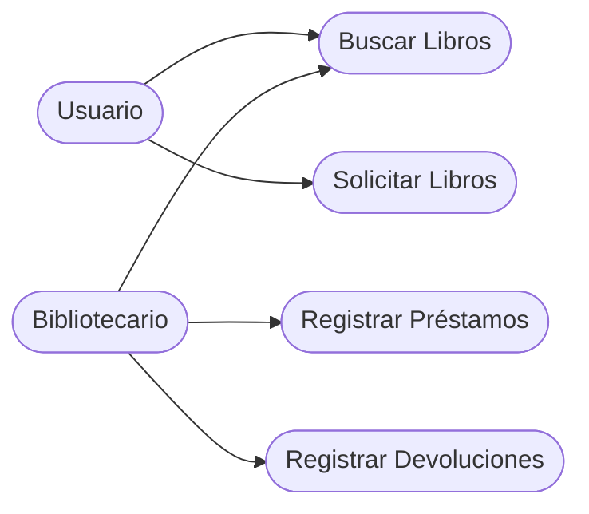

Diagrama casos de uso

```mermaid 
flowchart LR
    
    Usuario([Usuario])
    Bibliotecario([Bibliotecario])
    
    BuscarLibro([Buscar Libros])
    SolicitarLibro([Solicitar Libros])
    
    RegistrarPrestamo([Registrar Préstamos])
    RegistrarDevolucion([Registrar Devoluciones])
    
    Usuario --> BuscarLibro
    Usuario --> SolicitarLibro
    Bibliotecario --> BuscarLibro
    Bibliotecario --> RegistrarPrestamo
    Bibliotecario --> RegistrarDevolucion
```